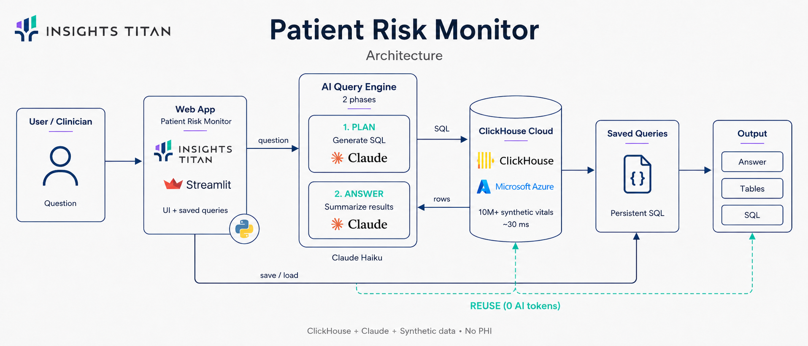

# Agentic ClickHouse Demos

Small, reproducible demos showing the same idea in different domains:

> **Agentic AI is only as good as the engine underneath it.**
> An agent that *investigates* runs dozens of queries to answer one goal.
> On a slow database that's unusable. On ClickHouse - milliseconds per query -
> the agent thinks fast enough to be genuinely useful.
> **ClickHouse is the engine behind AI agents.**

You give the agent a **goal**, not a question. It plans, runs many ClickHouse
queries, reads the results, drills into anomalies, and returns an
evidence-backed conclusion + recommended action - in seconds.

## Architecture



A question flows from the Streamlit app to a two-phase Claude engine (plan the SQL,
then summarize the rows), runs against ClickHouse in ~30 ms, and is saved so the
next run replays the SQL live with **0 AI tokens**.

---

## Demos

| # | Demo | What the agent investigates |
|---|------|------------------------------|
| 01 | [`healthcare_rpm`](demos/healthcare_rpm/) | Finds patients deteriorating in remote-monitoring data (~10M synthetic vitals) |

_(More coming - marketing analytics, etc. Each new demo is just a folder under `demos/`.)_

---

## Quick start (≈5 minutes)

**Prereqs:** Docker, Python 3.10+, and an `ANTHROPIC_API_KEY`.

```bash
# 1. start ClickHouse locally
docker compose up -d

# 2. python deps + config
pip install -r requirements.txt
cp .env.example .env        # then put your ANTHROPIC_API_KEY in .env

# 3. generate synthetic data (~10M rows; use --quick for a fast ~2M)
python demos/healthcare_rpm/generate_data.py

# 4a. run the agent in the terminal
python demos/healthcare_rpm/run.py

# 4b. ...or launch the web interface
streamlit run demos/healthcare_rpm/app.py
```

You'll watch the agent run query after query - each timed in milliseconds -
then deliver a ranked, explained risk report.

> All data is **100% synthetic**. No real people, no PHI.

---

## How it's built

```
src/core/
  db.py       # ClickHouse connection + timed query helper
  agent.py    # the reusable agentic loop (Claude tool-use + run_sql tool)
demos/
  healthcare_rpm/
    schema.sql        # ClickHouse tables
    generate_data.py  # synthetic data generator
    run.py            # wires the schema + goal into the agent
    GOAL.md           # what this demo proves
```

**To add a new demo:** create `demos/<your_demo>/` with its own `schema.sql`,
`generate_data.py`, and a `run.py` that calls `investigate(goal, schema)`.
The agent core doesn't change.

The agent loop is deliberately transparent - one tool (`run_sql`), a plain
message loop, prompt-cached system/schema so the multi-step investigation stays
cheap. Swap `AGENT_MODEL` in `.env` (`claude-sonnet-4-6` for speed,
`claude-opus-4-8` for max reasoning).
